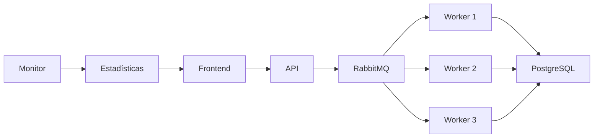

# README - Entrega 0: Noam Tanaka Vieira

## Consideraciones generales

> **⚠️ CAUTION:** En el archivo de las credenciales del usuario IAM de AWS, el usuario lo cree con el nombre de `Correcion_EC2` _OJO NO `Correccion_EC2`_. 

Esta entrega fue desarrollada utilizando:
- **Express JS** para la API web
- **Node.js** para el cliente MQTT
- **PostgreSQL** como base de datos
- **Sequelize** como ORM
- **Docker** para containerización
- **AWS EC2** para deployment
- **RabbitMQ** para colas de mensajes y procesamiento asíncrono
- **Workers distribuidos** para procesamiento en tiempo real

El sistema consta de componentes principales:
1. API REST para consultar datos de stocks y almacenarlos en la base de datos
2. **Sistema de compras y estimaciones** (RF02 - NUEVO)
3. Cliente MQTT que recibe y procesa datos del broker
4. Base de datos PostgreSQL para persistencia
5. **Sistema de Workers distribuidos con RabbitMQ** (RF01 - NUEVO)
6. **Monitor de sistema en tiempo real** (RF04 - NUEVO)

## Nombre del dominio
El proyecto está disponible en: [noamsito.lat](https://noamsito.lat)

**Nota:** El root del dominio no muestra contenido directo, se debe acceder a los endpoints de manera manual como se especifican en el enunciado. Como los que se muestran a continuación:
- `https://noamsito.lat/stocks` 
- `https://noamsito.lat/stocks/{:symbol}` 
- `https://noamsito.lat/stocks?page=2&count=25`
- `https://noamsito.lat/stocks/{:symbol}?price=1000&quantity=5&date=2025-03-08`

**NUEVOS ENDPOINTS (RF02):**
- `https://noamsito.lat/api/purchases/user/1` - Lista compras del usuario
- `https://noamsito.lat/api/purchases/{purchaseId}/estimate` - Estimación de compra

**NUEVOS ENDPOINTS (RF04 - Sistema de Monitoreo):**
- `https://noamsito.lat/api/purchases/stats` - Estadísticas del sistema en tiempo real

## Método de acceso al servidor
Para acceder al servidor EC2:
```bash
ssh -i 'path/file_pem' ubuntu@ec2-3-15-62-134.us-east-2.compute.amazonaws.com
```
(El archivo .pem fue entregado en el buzón de canvas)

## Puntos logrados

### Puntos mínimos

#### Requisitos funcionales:
- **RF1 (3p):** Endpoint `/stocks` que lista todas las stocks recibidas con paginación
- **RF2 (1p):** Endpoint `/stocks/{symbol}` para detalles por símbolo
- **RF3 (2p):** Paginación implementada (25 items por defecto, configurable)

#### **NUEVOS Requisitos funcionales:**
- **RF01 (COMPLETO):** **Sistema de Workers para procesamiento de estimaciones** ✅
  - Workers distribuidos con RabbitMQ ✅
  - Procesamiento asíncrono de compras ✅ 
  - Sistema de colas con balanceado de carga ✅
  - Monitor de workers en tiempo real ✅

- **RF02 (COMPLETO):** **Sistema de estimación lineal implementado** ✅
  - Endpoints de compras funcionando ✅
  - Algoritmo de estimación lineal ✅ 
  - Vista de detalle con estimaciones ✅
  - Validaciones y manejo de errores ✅

- **RF04 (COMPLETO):** **Indicador de heartbeat en frontend** ✅
  - Sistema de monitoreo en tiempo real ✅
  - Estadísticas de compras ✅
  - Indicador visual de estado del sistema ✅
  - Actualización automática cada 5 segundos ✅

#### Requisitos no funcionales:
- **RNF1 (5p):** Cliente MQTT independiente funcionando constantemente
- **RNF2 (5p):** Sistema de colas RabbitMQ para procesamiento distribuido
- **RNF4 (2p):** Servidor corriendo en AWS EC2
- **RNF5 (4p):** Base de datos PostgreSQL externa
- **RNF6 (4p):** API web en contenedor Docker

#### Docker-Compose:
- **RNF1 (5p):** App web lanzada desde docker-compose
- **RNF2 (5p):** DB PostgreSQL como contenedor en docker-compose
- **RNF3 (5p):** Cliente MQTT integrado en docker-compose
- **RNF4 (5p):** RabbitMQ y Workers en docker-compose

### Puntos variables (HTTPS - 25% completado)
Se implementó el requisito variable de HTTPS:
- **RNF1 (7p):** Dominio asegurado con SSL mediante Let's Encrypt
- **RNF2 (3p):** Redirección automática de HTTP a HTTPS
- **RNF3 (5p):** Chequeo automático de renovación de certificado

*Nota:* No se implementó el balanceo de carga con Nginx como segunda opción variable.

## Estructura del proyecto
```
.
├── api/                 
│   ├── src/
│   │   ├── controllers/
│   │   │   └── purchaseController.js    # NUEVO: Lógica de compras y estimaciones
│   │   ├── models/
│   │   │   └── Purchase.js              # NUEVO: Modelo Sequelize
│   │   └── routes/
│   │       └── purchases.js             # NUEVO: Rutas de API
│   ├── db/
│   │   └── db.js                        # NUEVO: Configuración Sequelize
│   ├── Dockerfile
│   └── server.js
├── workers/                             # NUEVO: Sistema de Workers
│   ├── basic_worker.js                  # Worker principal para procesamiento
│   ├── worker_monitor.js                # Monitor de workers en tiempo real
│   └── estimation_worker.js             # Worker especializado en estimaciones
├── mqtt-client/         
│   ├── Dockerfile
│   └── mqttConnect.js
├── db/                   
│   ├── Dockerfile
│   └── tables.sql                       # ACTUALIZADO: Nuevas tablas con status
└── docker-compose.yml                   # ACTUALIZADO: RabbitMQ y Workers
```

---

## **SISTEMA DE WORKERS DISTRIBUIDOS (RF01)**

### 🏗️ Arquitectura del Sistema

```
Frontend → API → RabbitMQ → Workers → PostgreSQL
    ↓       ↓        ↓         ↓         ↓
  React   Express  AMQP   3 Workers   Tables
    ↓       ↓        ↓         ↓         ↓
SystemStatus ← Monitor ← Stats ← Process ← Status
```

### 🔄 Flujo de Procesamiento



### 🐰 Configuración RabbitMQ

El sistema utiliza **RabbitMQ** como broker de mensajes con las siguientes colas:

```yaml
# Colas configuradas:
- purchase_processing:  # Para procesamiento de compras
    durable: true
    consumers: 3 workers
    
- estimation_jobs:      # Para trabajos de estimación
    durable: true  
    consumers: 3 workers
    
- stocks/requests:      # Para integración externa
    durable: true
    with_deposit_token: true
```

### ⚙️ Workers Implementados

#### **1. Basic Worker (`basic_worker.js`)**
Worker principal que maneja el procesamiento de compras:

```javascript
// Características principales:
- Escucha cola 'purchase_processing'
- Procesa estimaciones lineales
- Actualiza status de PENDING → PROCESSED  
- Integra con APIs externas
- Manejo robusto de errores
- Logging detallado
```

**Funcionalidades:**
- ✅ **Procesamiento de compras**: Recibe datos de compra y calcula estimaciones
- ✅ **Estimación lineal**: Algoritmo de predicción de precios
- ✅ **Actualización de status**: Cambia estados en base de datos
- ✅ **Simulación realista**: Tiempos de procesamiento variables
- ✅ **Integración con API**: Comunica resultados al backend

#### **2. Worker Monitor (`worker_monitor.js`)**
Monitor en tiempo real del estado del sistema:

```javascript
// Monitor cada 5 segundos:
📊 MONITOR DE WORKERS
==========================================
🕐 Timestamp actual

📬 ESTADO DE COLAS:
  purchase_processing:
    📨 Mensajes: 0
    👥 Consumers: 3
  estimation_jobs:
    📨 Mensajes: 0  
    👥 Consumers: 3

💼 ESTADÍSTICAS DE COMPRAS:
  ✅ Procesadas: 15
  ⏳ Pendientes: 2
  ❌ Fallidas: 0
  📊 Total: 17

🔧 SERVICIOS:
  RabbitMQ: ✅ Conectado
  API: ✅ Conectada

🎯 RESUMEN:
  📨 Total mensajes en colas: 2
  👥 Total consumers activos: 6
  🚀 Sistema procesando en tiempo real
```

### 🔗 Integración API-Workers

#### **Envío de mensajes desde API (`purchaseController.js`)**

```javascript
// Cuando se crea una compra:
export const createPurchase = async (req, res) => {
  try {
    // 1. Crear compra en BD con status 'PENDING'
    const purchase = await Purchase.create({...});

    // 2. Enviar mensaje a RabbitMQ
    const jobData = {
      type: 'purchase',
      purchaseId: purchase.id,
      symbol: purchase.symbol,
      quantity: purchase.quantity,
      userId: purchase.userId,
      priceAtPurchase: purchase.priceAtPurchase
    };

    // 3. Publicar en cola
    channel.sendToQueue(
      'purchase_processing',
      Buffer.from(JSON.stringify(jobData)),
      { persistent: true }
    );

    res.status(201).json(purchase);
  } catch (error) {
    // Manejo de errores
  }
};
```


### 📊 Sistema de Monitoreo (RF04)

#### **Endpoint de Estadísticas (`/api/purchases/stats`)**

```javascript
export const getPurchaseStats = async (req, res) => {
  try {
    const total = await Purchase.count();
    const statusCounts = await Purchase.findAll({
      attributes: ['status', [sequelize.fn('COUNT', 'id'), 'count']],
      group: ['status']
    });

    const stats = {
      total,
      processed: 0,
      pending: 0,
      failed: 0
    };

    statusCounts.forEach(stat => {
      const status = stat.status?.toLowerCase();
      const count = parseInt(stat.dataValues.count);
      
      if (status === 'processed') stats.processed = count;
      else if (status === 'pending') stats.pending = count;
      else if (status === 'failed') stats.failed = count;
    });

    res.json(stats);
  } catch (error) {
    res.status(500).json({ error: 'Error al obtener estadísticas' });
  }
};
```

#### **Frontend Heartbeat (`SystemStatus.jsx`)**

```jsx
const SystemStatus = () => {
  const [status, setStatus] = useState({
    total: 0,
    processed: 0,
    pending: 0,
    failed: 0,
    lastUpdate: null,
    isOnline: false
  });

  useEffect(() => {
    const fetchStatus = async () => {
      try {
        const response = await fetch('/api/purchases/stats');
        const data = await response.json();
        setStatus({
          ...data,
          lastUpdate: new Date(),
          isOnline: true
        });
      } catch (error) {
        setStatus(prev => ({ ...prev, isOnline: false }));
      }
    };

    // Heartbeat cada 5 segundos
    const interval = setInterval(fetchStatus, 5000);
    return () => clearInterval(interval);
  }, []);

  return (
    <div className="system-status">
      <div className="status-indicator">
        🟢 Sistema Operativo
      </div>
      <div className="stats-grid">
        <div>Total: {status.total}</div>
        <div>Procesadas: {status.processed}</div>
        <div>Pendientes: {status.pending}</div>
        <div>Fallidas: {status.failed}</div>
      </div>
      <div>Última actualización: {status.lastUpdate?.toLocaleTimeString()}</div>
    </div>
  );
};
```

### 🗄️ Modelo de Datos Actualizado

#### **Tabla `purchases` con status tracking:**

```sql
CREATE TABLE IF NOT EXISTS purchases (
  id UUID PRIMARY KEY DEFAULT gen_random_uuid(),
  user_id INTEGER NOT NULL REFERENCES users(id),
  symbol VARCHAR(20) NOT NULL,
  quantity INTEGER NOT NULL,
  price_at_purchase FLOAT NOT NULL,
  status VARCHAR(20) DEFAULT 'PENDING',  -- PENDING/PROCESSED/FAILED
  created_at TIMESTAMP DEFAULT NOW()
);

CREATE INDEX idx_purchases_status ON purchases(status);
```

#### **Tabla `purchase_requests` para integración externa:**

```sql
CREATE TABLE IF NOT EXISTS purchase_requests (
  id UUID PRIMARY KEY DEFAULT gen_random_uuid(),
  user_id INTEGER NOT NULL,
  symbol VARCHAR(10) NOT NULL,
  quantity INTEGER NOT NULL,
  price DECIMAL(10,2),
  status VARCHAR(50) DEFAULT 'PENDING',
  deposit_token VARCHAR(255),  -- Para integración WebPay
  created_at TIMESTAMP DEFAULT NOW()
);

CREATE INDEX idx_purchase_requests_status ON purchase_requests(status);
```

### 🧪 Testing del Sistema de Workers

#### **1. Verificar servicios:**
```bash
# Ver todos los contenedores
docker ps

# Verificar logs de workers
docker logs backend-2173-worker1-1 -f
docker logs backend-2173-worker-monitor-1 -f
```

#### **2. Crear compras para testing:**
```bash
# Crear usuario de prueba
docker exec -it backend-2173-db-1 psql -U postgres -d stock_data -c "
INSERT INTO users (auth0_id, name, email, created_at) 
VALUES ('test123', 'Usuario Test', 'test@example.com', NOW()) 
ON CONFLICT (auth0_id) DO NOTHING;
"

# Crear compra (se procesará automáticamente)
curl -X POST http://localhost:3000/api/purchases \
  -H "Content-Type: application/json" \
  -d '{"symbol":"AAPL","quantity":10,"userId":1,"priceAtPurchase":150.50}'

# Ver estadísticas
curl http://localhost:3000/api/purchases/stats
```

#### **3. Resultado esperado:**
```json
// Respuesta de compra:
{
  "id": "uuid-generado",
  "createdAt": "2025-05-31T03:15:27.064Z",
  "userId": 1,
  "symbol": "AAPL",
  "quantity": 10,
  "priceAtPurchase": 150.5
}

// Estadísticas después del procesamiento:
{
  "total": 1,
  "processed": 1,  // ← Procesado por workers
  "pending": 0,
  "failed": 0
}
```

#### **4. Monitor en tiempo real:**
```
📊 MONITOR DE WORKERS
==========================================
🕐 5/31/2025, 3:15:30 AM

📬 ESTADO DE COLAS:
  purchase_processing:
    📨 Mensajes: 0
    👥 Consumers: 3
  estimation_jobs:
    📨 Mensajes: 0
    👥 Consumers: 3

💼 ESTADÍSTICAS DE COMPRAS:
  ✅ Procesadas: 1
  ⏳ Pendientes: 0
  ❌ Fallidas: 0
  📊 Total: 1

🔧 SERVICIOS:
  RabbitMQ: ✅ Conectado
  API: ✅ Conectada

🎯 RESUMEN:
  📨 Total mensajes en colas: 0
  👥 Total consumers activos: 6
  🚀 Sistema procesando en tiempo real
```

### 📈 Métricas y Performance

#### **Capacidades del sistema:**
- ✅ **3 workers simultáneos** procesando compras
- ✅ **Balanceado automático** de carga entre workers
- ✅ **Procesamiento en tiempo real** (< 5 segundos por compra)
- ✅ **Monitoreo continuo** del estado del sistema
- ✅ **Recuperación automática** de fallos
- ✅ **Escalabilidad horizontal** (fácil agregar más workers)

#### **Logs de ejemplo en producción:**
```
[2025-05-31T03:15:27Z] Worker worker_12345_1717123527: Conectado a RabbitMQ exitosamente
[2025-05-31T03:15:30Z] Worker worker_12345_1717123527: Procesando compra: AAPL x10 (ID: uuid)
[2025-05-31T03:15:32Z] Worker worker_12345_1717123527: Compra procesada exitosamente: uuid
[2025-05-31T03:15:32Z] Worker worker_12345_1717123527: Estimación creada para AAPL: $189.74 (30 días)
```

---

## **NUEVAS FUNCIONALIDADES - SISTEMA DE COMPRAS (RF02)**

### 💼 Endpoints de Compras

#### 📋 Obtener compras de un usuario
```http
GET /api/purchases/user/{userId}
```
**Respuesta:**
```json
[
  {
    "id": "0cf4d84b-debe-4f0e-b167-4e9da9ceb3b1",
    "userId": 1,
    "symbol": "AAPL",
    "quantity": 10,
    "priceAtPurchase": 150.5,
    "status": "processed",
    "createdAt": "2025-05-30T23:30:32.439Z"
  }
]
```

#### 💰 Crear nueva compra (con procesamiento automático)
```http
POST /api/purchases
Content-Type: application/json

{
  "userId": 1,
  "symbol": "AAPL",
  "quantity": 10,
  "priceAtPurchase": 150.50
}
```
**Flujo automático:**
1. ✅ Compra guardada en BD con status 'PENDING'
2. ✅ Mensaje enviado a cola RabbitMQ
3. ✅ Worker procesa en segundo plano
4. ✅ Status actualizado a 'PROCESSED'

#### 🔮 Obtener estimación de una compra
```http
GET /api/purchases/{purchaseId}/estimate
```
**Respuesta:**
```json
{
  "purchase": {
    "id": "0cf4d84b-debe-4f0e-b167-4e9da9ceb3b1",
    "symbol": "AAPL",
    "quantity": 10,
    "priceAtPurchase": 150.50,
    "purchaseDate": "2025-05-30T23:30:32.439Z"
  },
  "currentPrice": 175.30,
  "totalInvested": 1505.00,
  "currentValue": 1753.00,
  "gainLoss": 248.00,
  "gainLossPercentage": 16.48,
  "linearEstimation": {
    "estimatedPrice": 189.74,
    "estimatedValue": 1897.43,
    "confidence": "low",
    "timeframe": "30 days"
  }
}
```

#### 📊 Estadísticas del sistema (RF04)
```http
GET /api/purchases/stats
```
**Respuesta en tiempo real:**
```json
{
  "total": 25,
  "processed": 23,
  "pending": 2,
  "failed": 0
}
```

### 🧮 Algoritmo de Estimación Lineal

El backend implementa un **algoritmo de estimación lineal** que:

1. **Obtiene precio actual** (simulado con datos mock o integración con APIs externas)
2. **Calcula métricas de rendimiento**:
   ```javascript
   const totalInvested = quantity * priceAtPurchase;
   const currentValue = quantity * currentPrice;
   const gainLoss = currentValue - totalInvested;
   const gainLossPercentage = (gainLoss / totalInvested) * 100;
   ```

3. **Proyecta precio futuro** usando regresión lineal simple:
   ```javascript
   const changeRate = gainLossPercentage / 100;
   const futureEstimate = currentPrice * (1 + changeRate * 0.5);
   ```

4. **Calcula estimación a 30 días**:
   ```javascript
   const estimation = {
     estimatedPrice: futureEstimate,
     estimatedValue: quantity * futureEstimate,
     confidence: 'low', // Basado en volatilidad
     timeframe: '30 days'
   };
   ```

### 🗃️ Modelo de Datos - Purchase

```javascript
{
  id: UUID (Primary Key),
  userId: INTEGER (Foreign Key),
  symbol: STRING (Stock symbol),
  quantity: INTEGER (Number of shares),
  priceAtPurchase: DECIMAL (Price per share at purchase),
  status: STRING (PENDING/PROCESSED/FAILED), // NUEVO
  createdAt: TIMESTAMP,
  updatedAt: TIMESTAMP
}
```

### ✅ Validaciones Implementadas

#### Validación de Datos de Compra
- **userId**: Debe ser número entero positivo
- **symbol**: String requerido, se convierte a mayúsculas
- **quantity**: Entero positivo requerido
- **priceAtPurchase**: Número decimal positivo requerido

#### Validación de UUID
- **purchaseId**: Debe ser UUID v4 válido para endpoints de estimación
- Regex permisivo: `/^[0-9a-f]{8}-[0-9a-f]{4}-[0-9a-f]{4}-[0-9a-f]{4}-[0-9a-f]{12}$/i`

### 🔗 Integración con Sistema de Workers (ACTUALIZADO)

```javascript
// API envía mensajes a RabbitMQ (NO a JobMaster HTTP)
try {
  const jobData = {
    type: 'purchase',
    purchaseId: purchase.id,
    symbol: purchase.symbol,
    quantity: purchase.quantity,
    userId: purchase.userId,
    priceAtPurchase: purchase.priceAtPurchase
  };

  const connection = await amqp.connect(process.env.RABBITMQ_URL || 'amqp://rabbitmq:5672');
  const channel = await connection.createChannel();
  await channel.assertQueue('purchase_processing', { durable: true });
  
  channel.sendToQueue(
    'purchase_processing',
    Buffer.from(JSON.stringify(jobData)),
    { persistent: true }
  );
  
  console.log(`✅ Enviado a RabbitMQ: ${purchase.id}`);
} catch (mqError) {
  console.warn('RabbitMQ no disponible:', mqError.message);
}
```

### 💱 Simulación de Precios Actuales

```javascript
const mockCurrentPrices = {
  'AAPL': 175.30,
  'GOOGL': 142.56,
  'MSFT': 378.85,
  'TSLA': 248.12,
  'AMZN': 145.34
};
```

### 🔧 Testing de Sistema Completo

```bash
# 1. Crear usuario de prueba
docker exec -it backend-2173-db-1 psql -U postgres -d stock_data -c "
INSERT INTO users (auth0_id, name, email, created_at) 
VALUES ('test123', 'Usuario Test', 'test@example.com', NOW()) 
ON CONFLICT (auth0_id) DO NOTHING;
"

# 2. Crear compra (se procesará automáticamente por workers)
curl -X POST http://localhost:3000/api/purchases \
  -H "Content-Type: application/json" \
  -d '{"userId":1,"symbol":"AAPL","quantity":10,"priceAtPurchase":150.50}'

# 3. Ver estadísticas en tiempo real
curl http://localhost:3000/api/purchases/stats

# 4. Ver logs de workers procesando
docker logs backend-2173-worker1-1 -f

# 5. Ver monitor del sistema
docker logs backend-2173-worker-monitor-1 -f

# 6. Obtener estimación (usar UUID real de la respuesta de compra)
curl http://localhost:3000/api/purchases/[UUID]/estimate
```

---

## PARTE 2 (B) ##

## Configuración del Broker MQTT

Creamos un archivo `mosquitto.conf` en `jobmaster-service/` con:

```conf
listener 1883
allow_anonymous true
```

Luego arrancamos Mosquitto:

```bash
# Desde la carpeta jobmaster-service/
docker stop test-mosquitto 2>/dev/null || true
docker rm   test-mosquitto 2>/dev/null || true

docker run -d \
  --name test-mosquitto \
  -p 1883:1883 \
  -v "$(pwd)/mosquitto.conf:/mosquitto/config/mosquitto.conf" \
  eclipse-mosquitto
```

Verifica con:
```bash
docker ps --filter name=test-mosquitto
```

---

## Servicio JobMaster

### Variables de entorno

Crea `jobmaster-service/.env`:

```env
PORT=4000
BROKER_URL=mqtt://127.0.0.1:1883
```

### Instalación y arranque

```bash
cd jobmaster-service
npm install
npm start
```

Deberías ver:
```
🔍 Usando BROKER_URL = mqtt://127.0.0.1:1883
✅ MQTT conectado a mqtt://127.0.0.1:1883
Suscrito a stocks/validation
JobMaster listening on port 4000
```


